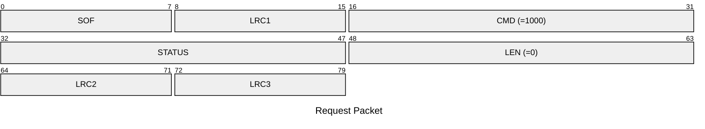
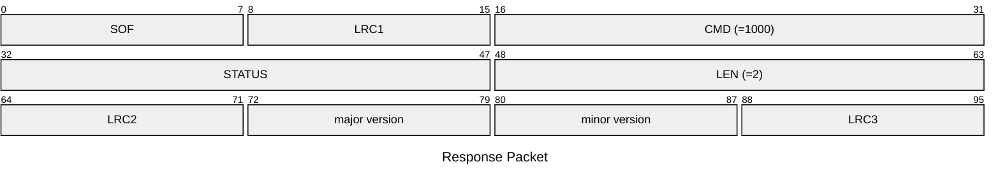

# 1000: GET_APP_VERSION **(DEPRECATED)**

> [!WARNING]
> This command is deprecated. For firmware version >= `v2.x`, please use [1017: GET_GIT_VERSION](./1017.md) instead.

Get firmware version.

Global firmware+CLI versions are following the [semantic versioning](https://semver.org/) logic mostly regarding the protocol version, so third party clients (GUIs, mobile apps, SDKs) can rely on firmware version to know their level of compatibility.

Given a version number MAJOR.MINOR.PATCH, we will increment the:

* MAJOR version when we are breaking the existing protocol format
* MINOR version when we are extending the protocol format in a backward compatible manner (new commands,...)
* PATCH version when we are releasing bugfixes not affecting the protocol description

Besides compatibility with a given firmware version, third party clients may choose to offer to the users the possibility to follow a stable release channel (installing only tagged releases) or the development channel (installing latest commits).

For the stable channel, a client compatible with versions X.y.z can accept any version > X.y'.z' but should refuse to work with a version X'>X.

For the development channel, a client compatible with versions X.y.z can accept any latest commit unless a tag X'.0.0 with X'>X is present in the repo, indicating that the corresponding commit and all the commits above are incompatible with the client version. There is still a non negligible risk that breaking changes are pushed while forgetting about putting a new tag, or artefacts being built before the tag being pushed. Here be dragons... It's always a good practice for the client to validate whatever data is transmitted by the firmware, and fail gracefully in case of hiccups.

cli example: `hw version`

## Request Packet

* DATA in Request Packet: None

## Response Packet

* DATA in Response Packet
    * major version: `1 byte`, major version number
    * minor version: `1 byte`, minor version number