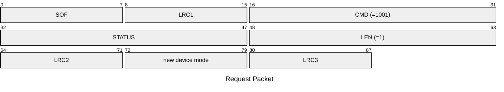
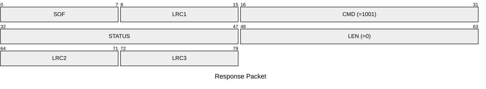

# 1001: CHANGE_DEVICE_MODE

Change device mode between reader/writer and emulator.

* CLI: cf `hw mode`

## Request Packet

* DATA in Request Packet
    * device mode: `1 byte`, `0x00`=emulator mode, `0x01`=reader/writer mode

## Response Packet

* DATA in Response Packet: None