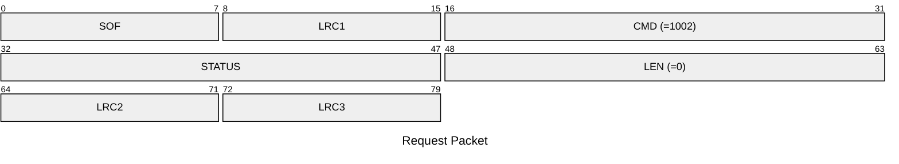
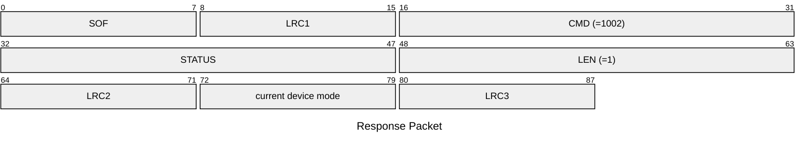

# 1002: GET_DEVICE_MODE

* CLI: cf `hw mode`

## Request Packet

* DATA in Request Packet: None

## Response Packet

* DATA in Response Packet
    * device mode: `1 byte`, `0x00`=emulator mode, `0x01`=reader/writer mode