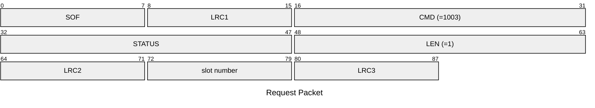
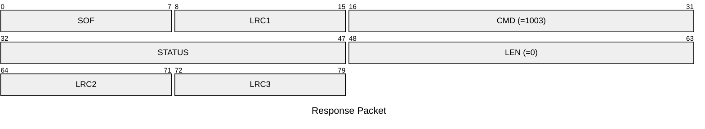

# 1003: SET_ACTIVE_SLOT

Set active slot number.

* CLI: cf `hw slot change`

## Request Packet

* DATA in Request Packet
    * slot number: `1 byte`, between `0` and `7`.

## Response Packet

* DATA in Response Packet: None