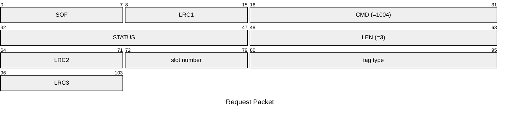
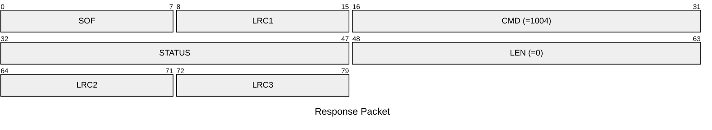

# 1004: SET_SLOT_TAG_TYPE

* CLI: cf `hw slot type`

## Request Packet

* DATA in Request Packet
    * slot number: `1 byte`, between `0` and `7`.
    * tag type: `2 bytes`, U16 in network byte order, according to `tag_specific_type_t` enum.

## Response Packet

* DATA in Response Packet: None