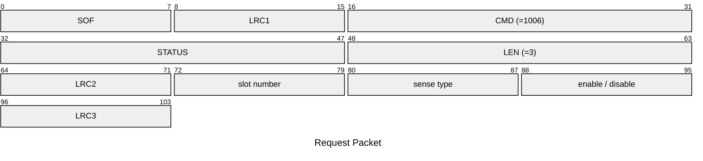
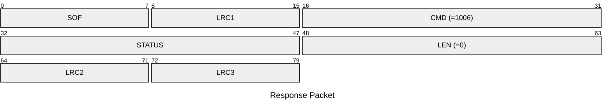

# 1006: SET_SLOT_ENABLE

Enable/disable specific slot HF/LF.

* CLI: cf `hw slot enable` / `hw slot disable`

## Request Packet

* DATA in Request Packet
    * slot number: `1 byte`, between `0` and `7`.
    * sense type: `1 byte`, according to `tag_sense_type_t` enum.
    * enable / disable: `1 byte`, `0x01`=enable, `0x00`=disable.

## Response Packet

* DATA in Response Packet: None