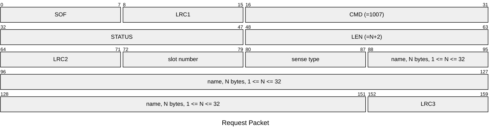
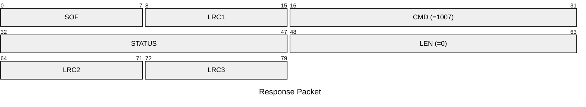

# 1007: SET_SLOT_TAG_NICK

* CLI: cf `hw slot nick`

## Request Packet

* DATA in Request Packet
    * slot number: `1 byte`, between `0` and `7`.
    * sense type: `1 byte`, according to `tag_sense_type_t` enum.
    * name: `N bytes`, `1 <= N <= 32`, UTF-8 encoded string, no null terminator.

## Response Packet

* DATA in Response Packet: None