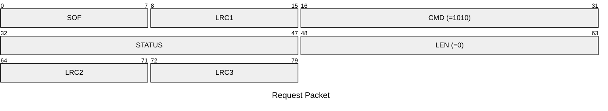

# 1010: ENTER_BOOTLOADER

Enter bootloader mode.

* CLI: cf `hw dfu`

## Request Packet

* DATA in Request Packet: None

## Response Packet

* No response packet for this special command. The device will disconnect immediately and reboot into bootloader mode for DFU (Device Firmware Update).