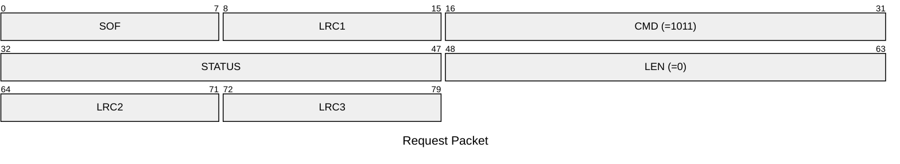
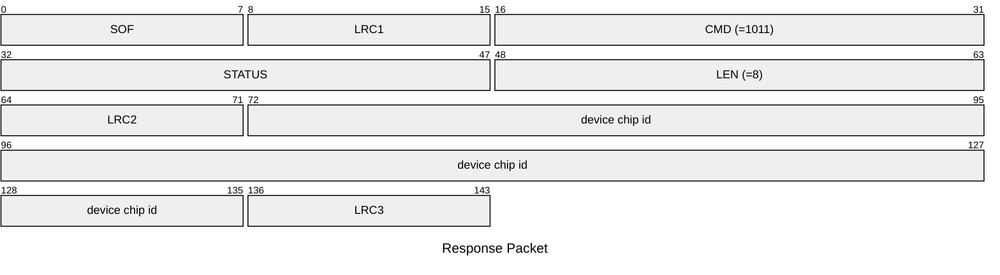

# 1011: GET_DEVICE_CHIP_ID

Get device chip ID.

* CLI: cf `hw chipid`

## Request Packet

* DATA in Request Packet: None

## Response Packet

* DATA in Response Packet
    * device chip id: `8 bytes`, U64 in network byte order.