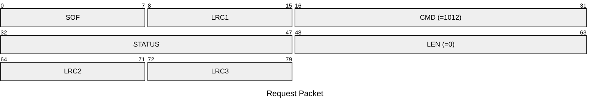
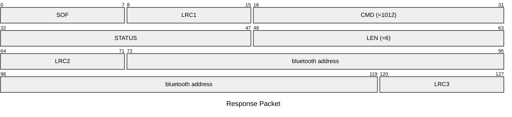

# 1012: GET_DEVICE_ADDRESS

* CLI: cf `hw address`

## Request Packet

* DATA in Request Packet: None

## Response Packet

* DATA in Response Packet
    * bluetooth address: `6 bytes`, U48 in network byte order.