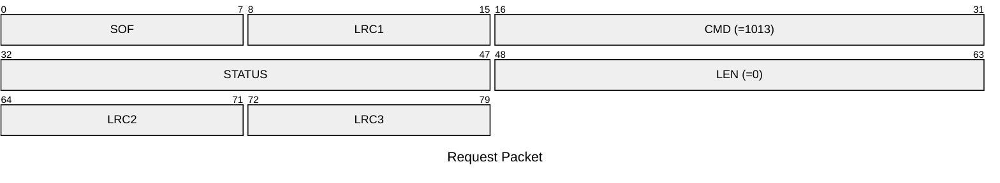
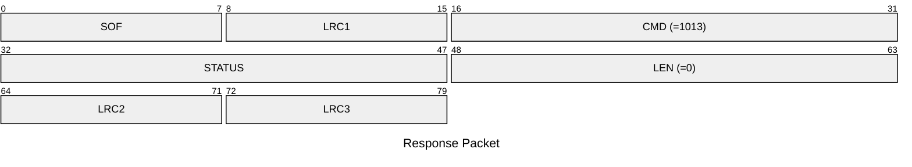

# 1013: SAVE_SETTINGS

Save device settings.

* CLI: cf `hw settings store`

## Request Packet

```mermaid
---
title: "Request Packet"
---
packet
+8: "SOF"
+8: "LRC1"
+16: "CMD (=1013)"
+16: "STATUS"
+16: "LEN (=0)"
+8: "LRC2"
+8: "LRC3"
```

* DATA in Request Packet: None

## Response Packet

```mermaid
---
title: "Response Packet"
---
packet
+8: "SOF"
+8: "LRC1"
+16: "CMD (=1013)"
+16: "STATUS"
+16: "LEN (=0)"
+8: "LRC2"
+8: "LRC3"
```

* DATA in Response Packet: None