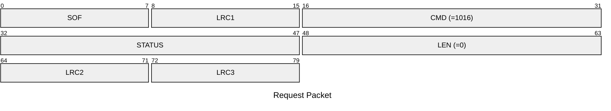
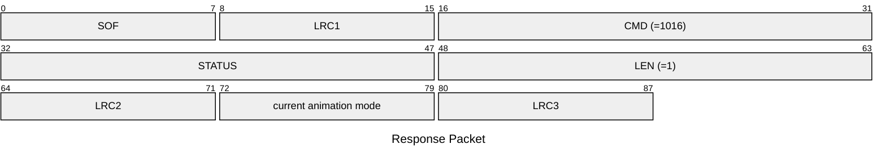

# 1016: GET_ANIMATION_MODE

* CLI: cf `hw settings animation`

## Request Packet

* DATA in Request Packet: None

## Response Packet

* DATA in Response Packet
    * animation mode: `1 byte`, according to `settings_animation_mode_t` enum.