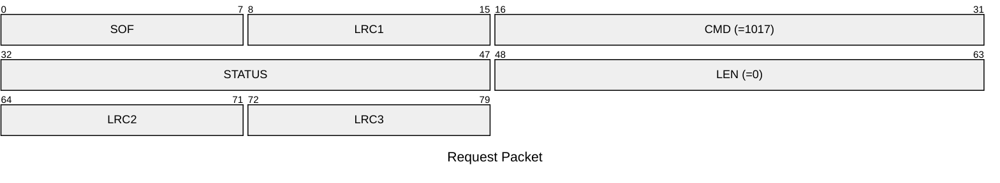
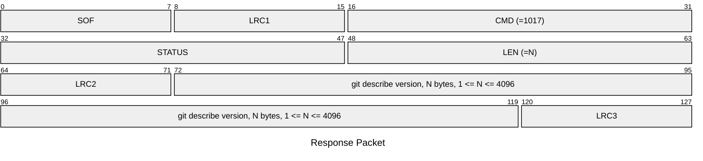

# 1017: GET_GIT_VERSION

Get `git describe` version string of source code.

> [!NOTE]
> The git describe version is generated by running `git describe --abbrev=7 --dirty --always --tags --match "v*.*"`. The output depends on the repository’s current status and can be:
> 
> * A short tag like `v2.0.0` if the firmware is built from a tagged commit.
> * A longer tag indicating how many commits it is from the latest tag and the 7 prefix nibbles of commit hash, prepended with `g`. For example, if there are 5 commits after v2.0.0: `v2.0.0-5-g617d6d0`
> * The same format as above but appended with `-dirty` if you have local changes that haven’t been committed yet, for example: `v2.0.0-5-g617d6d0-dirty`

* CLI: cf `hw version`

## Request Packet

* DATA in Request Packet: None

## Response Packet

* DATA in Response Packet
    * git describe version: `N bytes`, a UTF-8 encoded string, no null terminator.