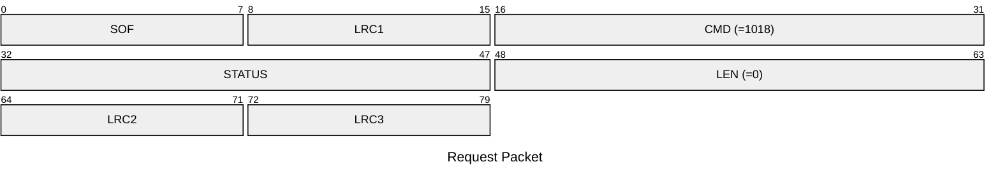
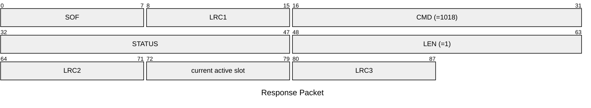

# 1018: GET_ACTIVE_SLOT

Get active slot number.

* CLI: cf `hw slot list`

## Request Packet

* DATA in Request Packet: None

## Response Packet

* DATA in Response Packet
    * current active slot: `1 byte`, between `0` and `7`.