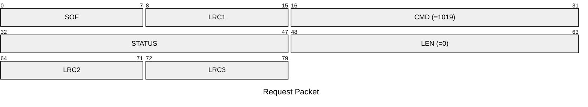
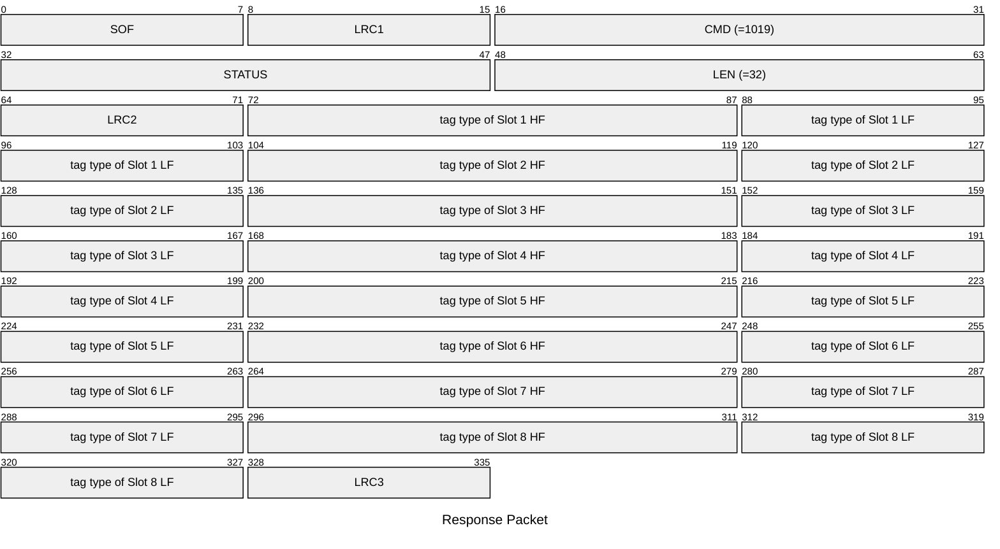

# 1019: GET_SLOT_INFO

* CLI: cf `hw slot list`

## Request Packet

* DATA in Request Packet: None

## Response Packet

* DATA in Response Packet
    * tag type: `2 bytes`, U16 in network byte order, according to `tag_specific_type_t` enum.