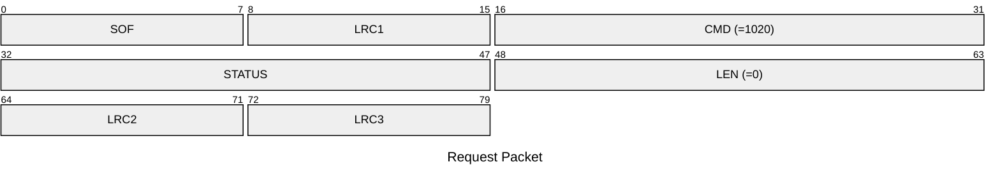
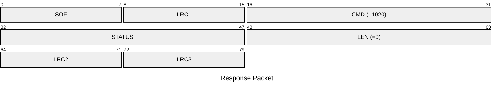

# 1020: WIPE_FDS

Device factory reset.

The device will reboot shortly after this command.

* CLI: cf `hw factory_reset`

## Request Packet

* DATA in Request Packet: None

## Response Packet

* STATUS in Response Packet
    * `STATUS_SUCCESS`: Success
    * `STATUS_FLASH_WRITE_FAIL`: Fail
* DATA in Response Packet: None