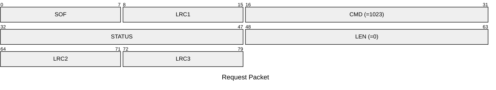
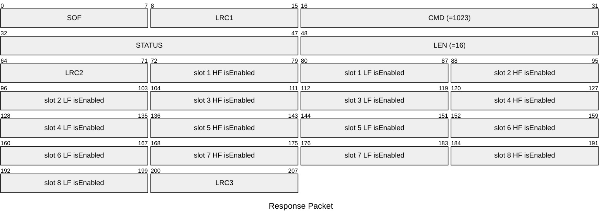

# 1023: GET_ENABLED_SLOTS

Get enabled/disabled of all slots HF/LF.

* CLI: cf `hw slot list`

## Request Packet

* DATA in Request Packet: None

## Response Packet

* DATA in Response Packet
    * slot ? HF isEnabled: `1 byte`, `0`=disabled, `1`=enabled
    * slot ? LF isEnabled: `1 byte`, `0`=disabled, `1`=enabled