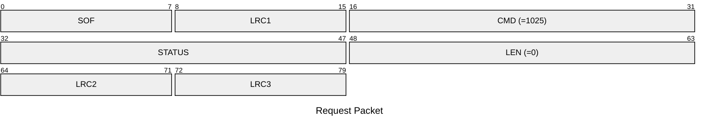
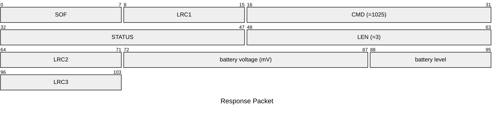

# 1025: GET_BATTERY_INFO

> [!NOTE]
> Please wait about 5 seconds after the device wakes up before executing this command; otherwise, the command may not correctly measure the device's battery and will return `0`.

* CLI: cf `hw battery`

## Request Packet

* DATA in Request Packet: None

## Response Packet

* DATA in Response Packet
    * battery voltage: `2 bytes`, U16 in network byte order. Unit: `mV`.
    * battery level: `1 byte`, between `0` and `100`.