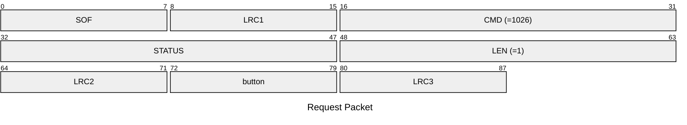
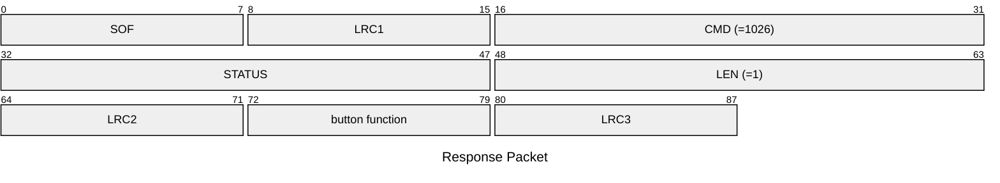

# 1026: GET_BUTTON_PRESS_CONFIG

Get button press function of specific button.

* CLI: cf `hw settings btnpress`

## Request Packet

* DATA in Request Packet
    * button: `1 byte`, Char `'A'`/`'a'`: Button A, Char `'B'`/`'b'`: Button B.

## Response Packet

* DATA in Response Packet
    * button function: `1 byte`, according to `settings_button_function_t` enum.