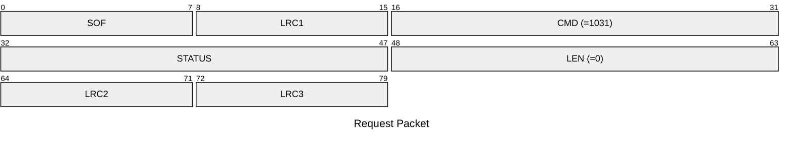
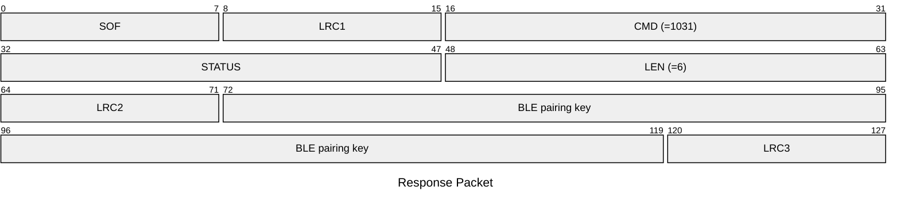

# 1031: GET_BLE_PAIRING_KEY

* CLI: cf `hw settings blekey`

## Request Packet

* DATA in Request Packet: None

## Response Packet

* DATA in Request Packet
    * BLE pairing key: `6 bytes`, ASCII-encoded digits.