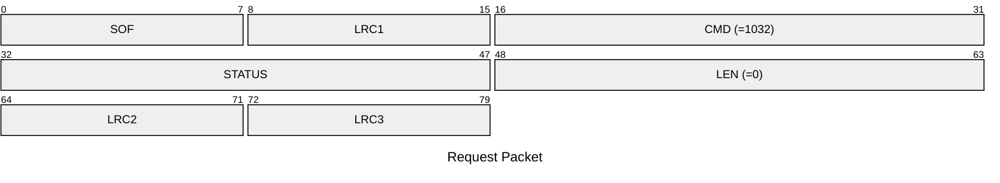
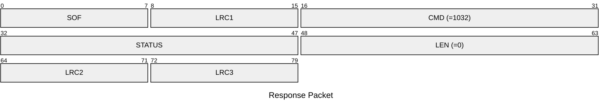

# 1032: DELETE_ALL_BLE_BONDS

Delete all BLE bonded devices.

* CLI: cf `hw settings bleclearbonds`

## Request Packet

* DATA in Request Packet: None

## Response Packet

* DATA in Response Packet: None