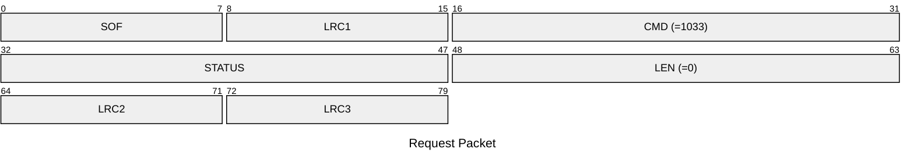
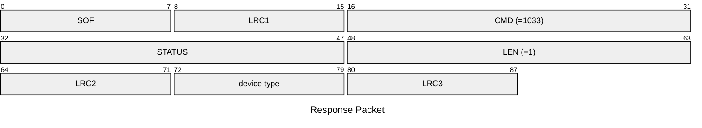

# 1033: GET_DEVICE_MODEL

* CLI: cf `hw version`

## Request Packet

* DATA in Request Packet: None

## Response Packet

* DATA in Response Packet
    * device type: `1 byte`, according to `chameleon_device_type_t` enum (`0`=Ultra, `1`=Lite)