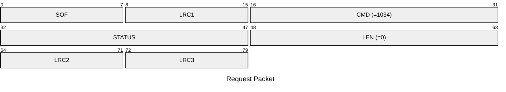
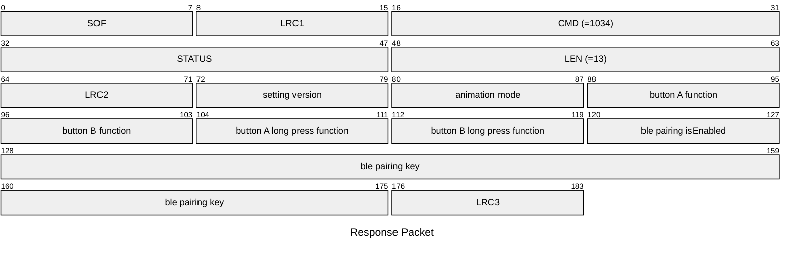

# 1034: GET_DEVICE_SETTINGS

* CLI: unused

## Request Packet

* DATA in Request Packet: None

## Response Packet

* DATA in Response Packet
    * setting version: latest version is `5`
    * animation mode: `1 byte`, according to `animation_mode_t` enum
    * button A function: `1 byte`, according to `button_function_t` enum
    * button B function: `1 byte`, according to `button_function_t` enum
    * button A long press function: `1 byte`, according to `button_function_t` enum
    * button B long press function: `1 byte`, according to `button_function_t` enum
    * ble pairing isEnabled: `1 byte`, `0`=disabled, `1`=enabled
    * ble pairing key: `6 bytes`, ASCII-encoded digits.