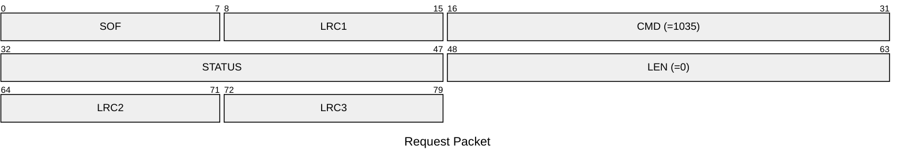
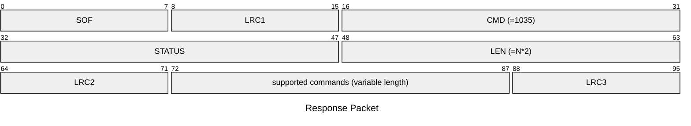

# 1035: GET_DEVICE_CAPABILITIES

Get supported command IDs.

## Request Packet

* DATA in Request Packet: None

## Response Packet

* DATA in Response Packet
    * supported commands: `N*2 bytes` in network byte order, a list of supported commands IDs.