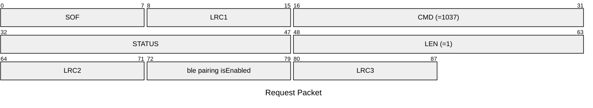
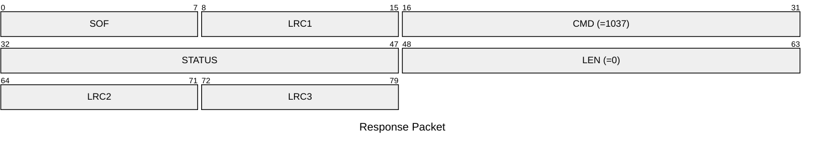

# 1037: SET_BLE_PAIRING_ENABLE

* CLI: cf `hw settings blepair`

## Request Packet

* DATA in Request Packet
    * ble pairing isEnabled: `1 byte`, `0`=disabled, `1`=enabled

## Response Packet

* DATA in Response Packet: None