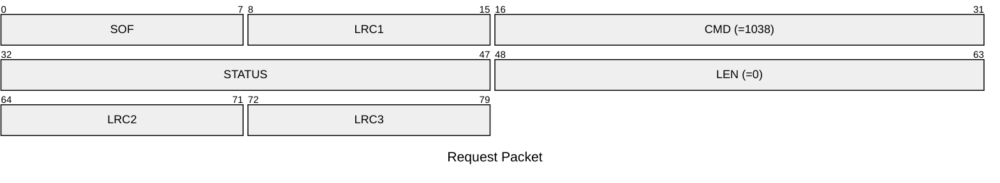
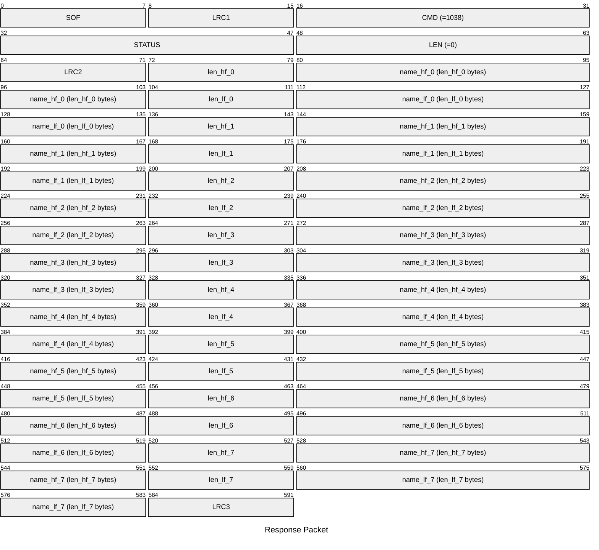

# 1038: GET_ALL_SLOT_NICKS

Get nickname of all slots HF/LF.

## Request Packet

* DATA in Request Packet: None

## Response Packet

* DATA in Response Packet
    * For each slot (0-7):
        * len_hf_X: `1 byte`, length of HF nickname of slot X
        * name_hf_X: `len_hf_X bytes`, HF nickname of slot X (UTF-8)
        * len_lf_X: `1 byte`, length of LF nickname of slot X
        * name_lf_X: `len_lf_X bytes`, LF nickname of slot X (UTF-8)