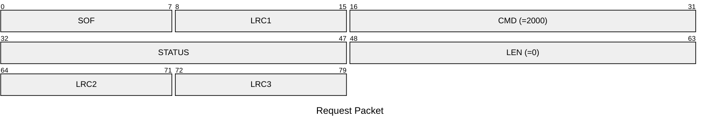
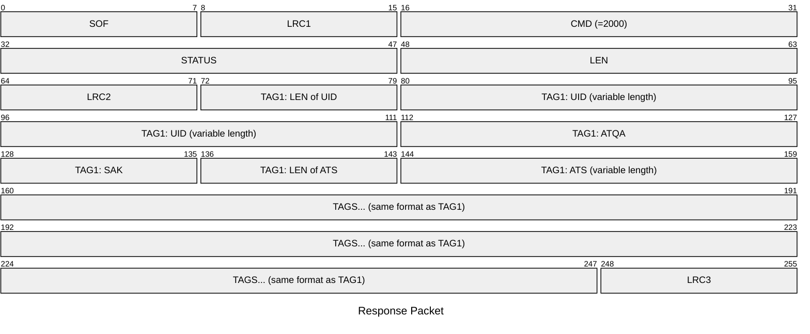

# 2000: HF14A_SCAN

Scan UID, ATQA, SAK, ATS of 14443-3 (Type A) tags.

> [!NOTE]
> * remind that if no tag is present, status will be `STATUS_HF_TAG_NO` and Response empty.
> * at the moment, the firmware supports only one tag, but get your client ready for more!
> * `atslen` must not be confused with `ats[0]`==`TL`. So `atslen|ats` = `00` means no ATS while `0100` would be an empty ATS.

* CLI: cf `hf 14a scan`

## Request Packet

* DATA in Request Packet: None

## Response Packet

* DATA in Response Packet
    * LEN of UID: `1 byte`, length of tag UID
    * UID: `N bytes`, tag UID
    * ATQA: `2 bytes`, tag ATQA
    * SAK: `1 byte`, tag SAK
    * LEN of ATS: `1 byte`, length of tag ATS
    * ATS: `N bytes`, tag ATS