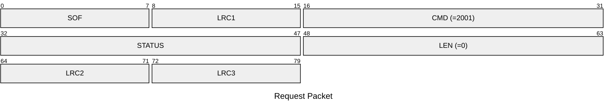
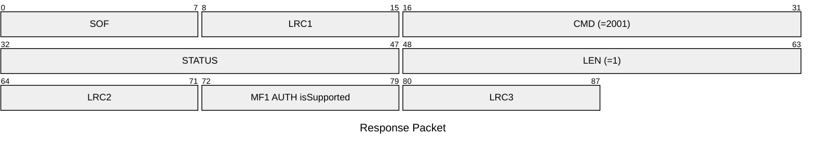

# 2001: MF1_DETECT_SUPPORT

* CLI: cf `hf 14a info`

## Request Packet

* DATA in Request Packet: None

## Response Packet

* DATA in Response Packet
    * MF1 AUTH isSupported: `1 byte`, `0`=not supported, `1`=supported