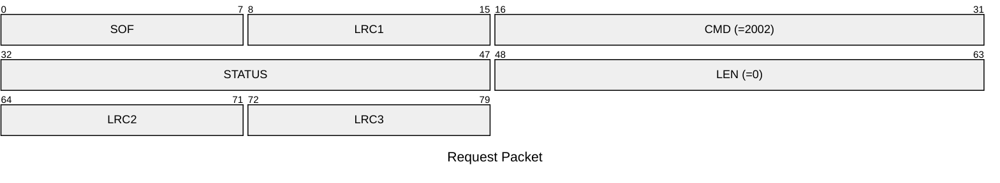
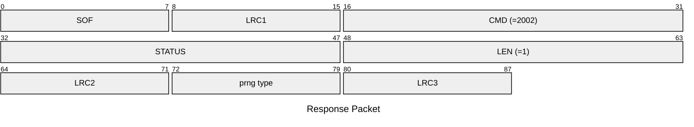

# 2002: MF1_DETECT_PRNG

* CLI: cf `hf 14a info`

## Request Packet

* DATA in Request Packet: None

## Response Packet

* DATA in Response Packet
    * prng type: `1 byte`, according to `mf1_prng_type_t` enum