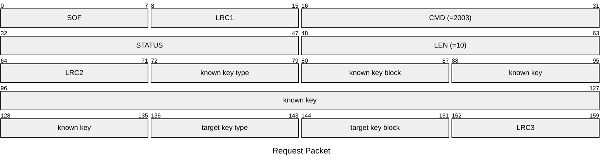
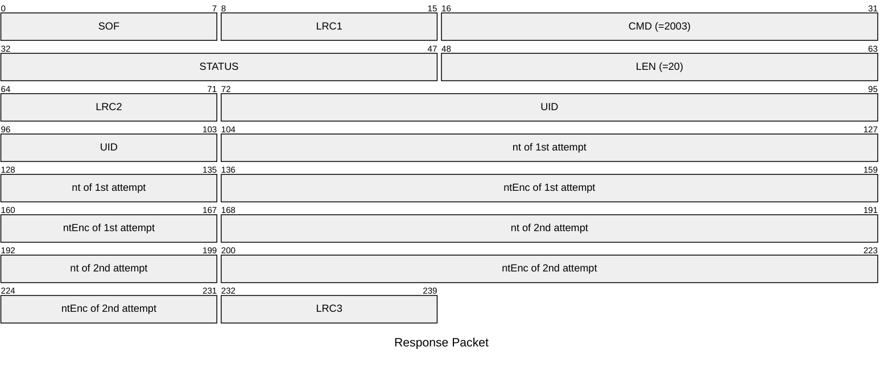

# 2003: MF1_STATIC_NESTED_ACQUIRE

* CLI: cf `hf mf nested` on static nonce tag

## Request Packet

* DATA in Request Packet
    * known key type: `1 byte`, `0x60`=key A, `0x61`=key B.
    * known key block: `1 byte`.
    * known key: `6 bytes`, the known key.
    * target key type: `1 byte`, `0x60`=key A, `0x61`=key B.
    * target key block: `1 byte`.

## Response Packet

* DATA in Response Packet
    * UID: `4 bytes`, U32 in network byte order, the tag UID.
    * nt: `4 bytes`, U32 in network byte order, the tag nonce in first AUTH.
    * ntEnc: `4 bytes`, U32 in network byte order, the encrypted tag nonce in nested AUTH.