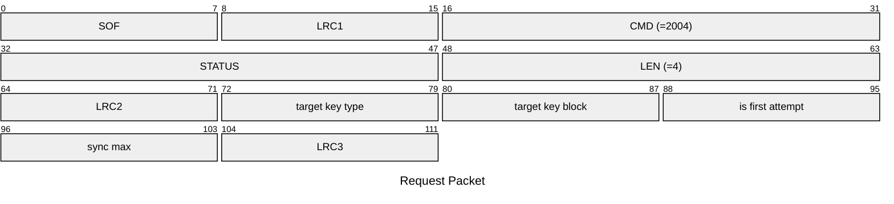
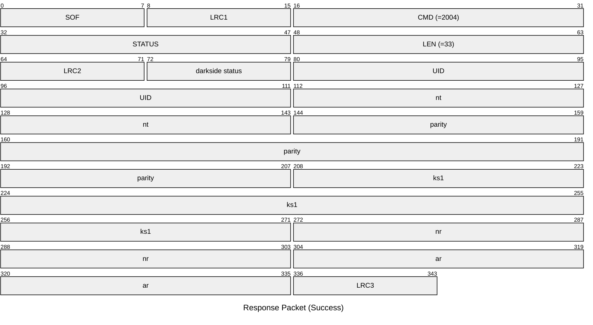
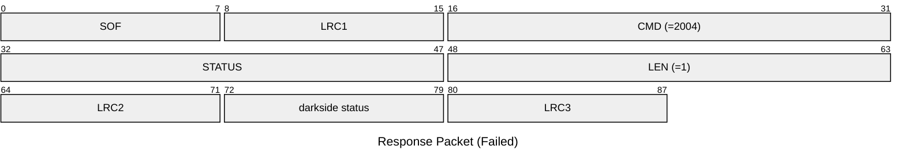

# 2004: MF1_DARKSIDE_ACQUIRE

Acquire necessary data from Mifare Classic tag for Darkside attack.

* CLI: cf `hf mf darkside`

## Request Packet

* DATA in Request Packet
    * target key type: `1 byte`, `0x60`=key A, `0x61`=key B.
    * target key block: `1 byte`.
    * is first attempt: `1 byte`, `0`=no, `1`=yes.
    * sync max: `1 byte`, the maximum number of synchronization attempts.

## Response Packet

* DATA in Response Packet
    * darkside status: `1 byte`, according to `mf1_darkside_status_t` enum.
    * UID: `4 bytes`, U32 in network byte order, the tag UID.
    * nt: `4 bytes`, U32 in network byte order, the tag nonce in AUTH.
    * parity: `8 bytes`, U64 in network byte order, the parity bits in AUTH.
    * ks1: `8 bytes`, U64 in network byte order, the keystream1 in AUTH.
    * nr: `4 bytes`, U32 in network byte order, the reader encrypted nonce in AUTH.
    * ar: `4 bytes`, U32 in network byte order, the reader encrypted answer in AUTH.