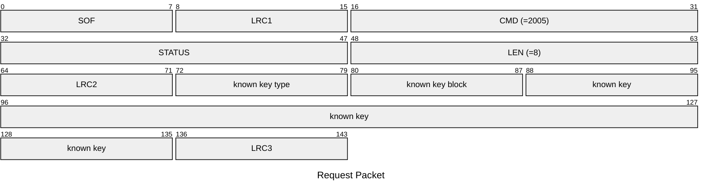
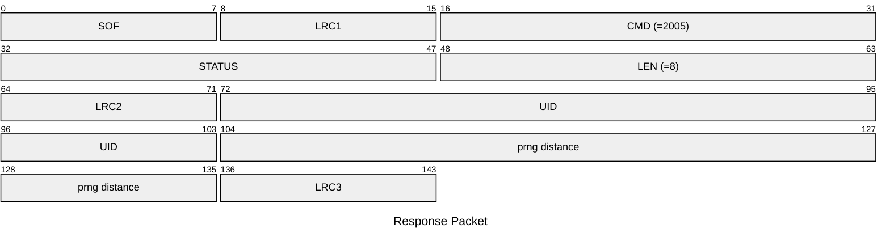

# 2005: MF1_DETECT_NT_DIST

Detect tag nonce distance of Mifare Classic tag.

* CLI: cf `hf mf nested`

## Request Packet

* DATA in Request Packet
    * known key type: `1 byte`, `0x60`=key A, `0x61`=key B.
    * known key block: `1 byte`.
    * known key: `6 bytes`, the known key.

## Response Packet

* DATA in Response Packet
    * UID: `4 bytes`, U32 in network byte order, the tag UID.
    * prng distance: `4 bytes`, U32 in network byte order, the PRNG distance.