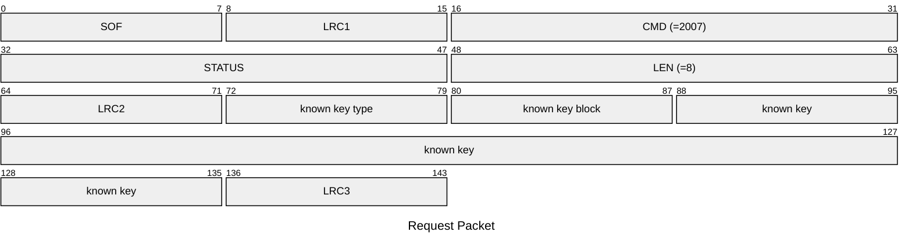
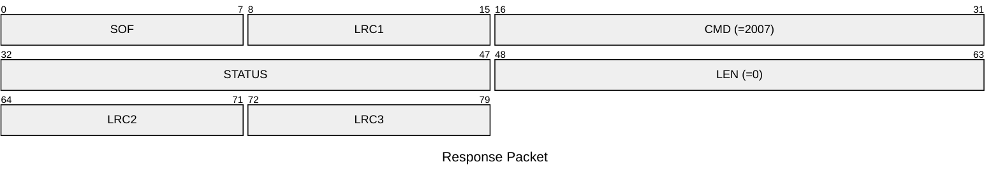

# 2007: MF1_AUTH_ONE_KEY_BLOCK

AUTH specific block and key type of Mifare Classic tag.

* CLI: cf `hf mf nested`

## Request Packet

* DATA in Request Packet
    * known key type: `1 byte`, `0x60`=key A, `0x61`=key B.
    * known key block: `1 byte`.
    * known key: `6 bytes`, the known key.

## Response Packet

* STATUS in Response Packet
    * `STATUS_HF_TAG_OK`: auth succeeded
    * otherwise: according to `app_status.h`
* DATA in Response Packet: None