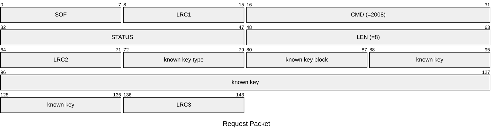
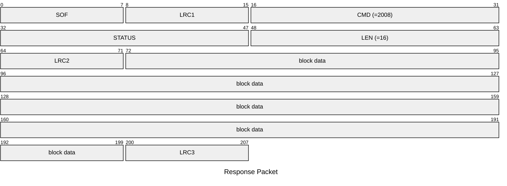

# 2008: MF1_READ_ONE_BLOCK

Read specific block of Mifare Classic tag.

* CLI: cf `hf mf rdbl`

## Request Packet

* DATA in Request Packet
    * known key type: `1 byte`, `0x60`=key A, `0x61`=key B.
    * known key block: `1 byte`.
    * known key: `6 bytes`, the known key.

## Response Packet

* DATA in Response Packet
    * block data: `16 bytes`, the block data read from the tag.