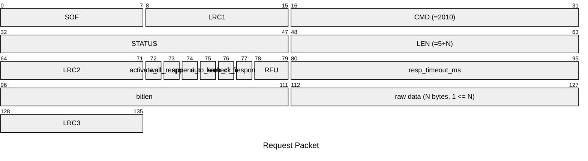
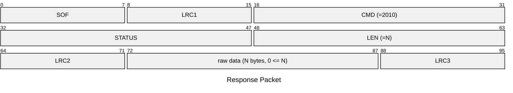

# 2010: HF14A_RAW

Send raw 14443-3 (Type A) commands with options.

* CLI: cf `hf 14a raw`

## Request Packet

* DATA in Request Packet
    * activate_rf_field: `1 bit`, whether to activate the RF field before sending the raw data.
    * wait_response: `1 bit`, whether to wait for a response from the tag after sending the raw data.
    * append_crc: `1 bit`, whether to append a CRC to the raw data before sending it.
    * auto_select: `1 bit`, whether to automatically select tag before sending the raw data.
    * keep_rf_field: `1 bit`, whether to keep the RF field active after sending the raw data.
    * check_response_crc: `1 bit`, whether to check the CRC of the response from the tag.
    * resp_timeout_ms: `2 bytes`, U16 in network byte order, the timeout in milliseconds to wait for a response from the tag.
    * bitlen: `2 bytes`, U16 in network byte order, the length of the raw data to send in bits.
    * raw data: `N bytes, 1 <= N`, the raw data to send to the tag. If `bitlen` is not a multiple of 8, the last byte should be padded with zeros in the least significant bits.

## Response Packet

* DATA in Response Packet: data sent by the card
    * raw data: `N bytes, 0 <= N`, the raw data received from the tag. If no response is received, N will be 0. If bit length of raw data is not a multiple of 8, the last byte will be padded with zeros in the least significant bits.