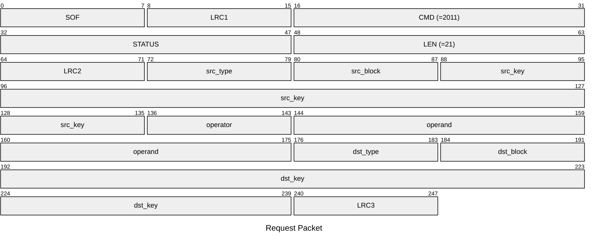
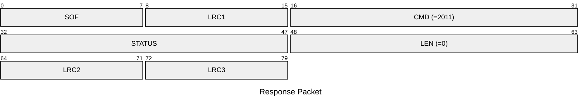

# 2011: MF1_MANIPULATE_VALUE_BLOCK

* CLI: cf `hf mf value`

## Request Packet

* DATA in Request Packet
    * src_type: `1 byte`, key type of source block. `0x60` for key A, `0x61` for key B.
    * src_block: `1 byte`, block number of source block.
    * src_key: `6 bytes`, key for source.
    * operator: `1 byte`, operation to perform. `0xC0` for decrement, `0xC1` for increment, `0xC2` for restore.
    * operand: `4 bytes`, I32 in network byte order. Value to increment/decrement by. Ignored for restore.
    * dst_type: `1 byte`, key type of destination block. `0x60` for key A, `0x61` for key B.
    * dst_block: `1 byte`, block number of destination block.
    * dst_key: `6 bytes`, key for destination.

## Response Packet

* DATA in Response Packet: None