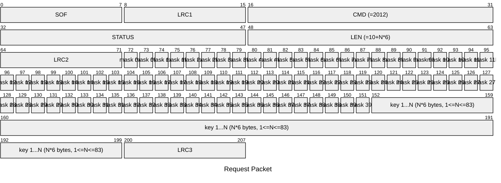
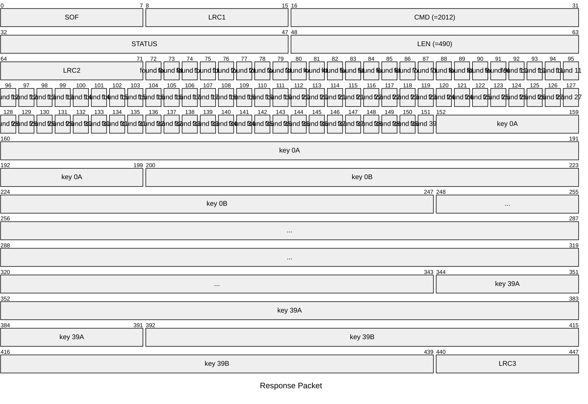

# 2012: MF1_CHECK_KEYS_OF_SECTORS

Check keys on sectors of Mifare Classic tag in batch.

* CLI: cf `hf mf fchk`

## Request Packet

* DATA in Request Packet
    * mask ?A/?B: `1 bit`, `0b1` represent to skip checking specific block and specific key type.
    * key 1...N: `6 bytes/key`, keys to be check.

## Response Packet

* DATA in Response Packet
    * found ?A/?B: `1 bit`, `0b1` represent the key is found for specific block and specific key type.
    * key ?A/?B: `6 bytes`, key for the specific block and specific key type. If the key is not found, the key will be fill with `0x000000000000`.