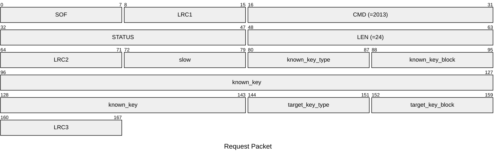
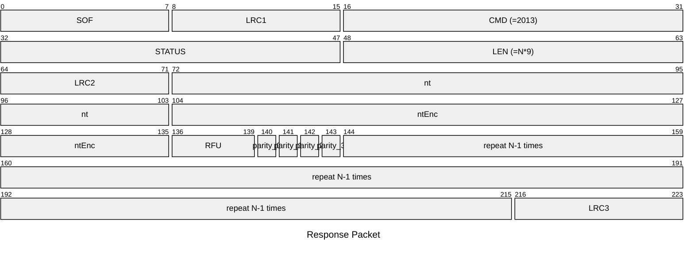

# 2013: MF1_HARDNESTED_ACQUIRE

Acquire necessary data from Mifare Classic tag for hardnested attack.

## Request Packet

* DATA in Request Packet
    * slow: `1 byte`, `0x00`=normal speed, `0x01`=slow speed (for hardnested acquisition).
    * known_key_type: `1 byte`, `0x60`=key A, `0x61`=key B.
    * known_key_block: `1 byte`.
    * known_key: `6 bytes`, the known key.
    * target_key_type: `1 byte`, `0x60`=key A, `0x61`=key B.
    * target_key_block: `1 byte`.

## Response Packet

* DATA in Response Packet
    * repeat N times:
        * nt: `4 bytes`, tag nonce of nested authentication.
        * ntEnc: `4 bytes`, encrypted tag nonce of nested authentication.
        * parity_0: `1 bit`, parity bit of first byte of ntEnc.
        * parity_1: `1 bit`, parity bit of second byte of ntEnc.
        * parity_2: `1 bit`, parity bit of third byte of ntEnc.
        * parity_3: `1 bit`, parity bit of fourth byte of ntEnc.