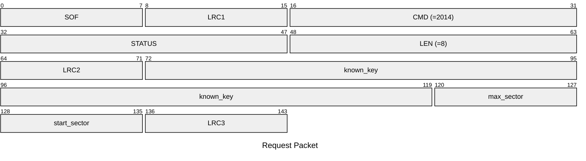
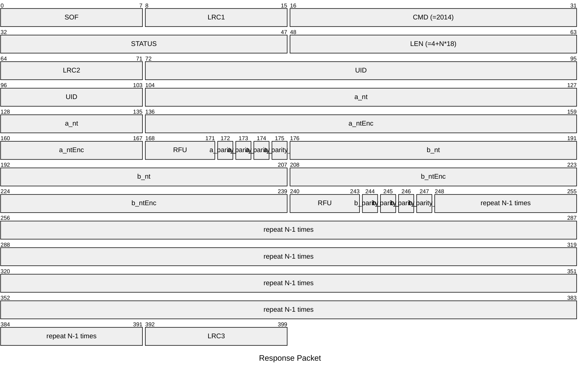

# 2014: MF1_ENC_NESTED_ACQUIRE

Acquire necessary data from Mifare Classic tag for encrypted nested attack.

## Request Packet

* DATA in Request Packet
    * known_key: `6 bytes`, the known key.
    * max_sector: `1 byte`, the maximum sector number to acquire.
    * start_sector: `1 byte`, the start sector number to acquire.

## Response Packet

* DATA in Response Packet
    * UID: `4 bytes`, the UID of the tag.
    * repeat N times:
        * a_nt: `4 bytes`, tag nonce of nested authentication.
        * a_ntEnc: `4 bytes`, encrypted tag nonce of nested authentication.
        * a_parity_0: `1 bit`, parity bit of first byte of ntEnc.
        * a_parity_1: `1 bit`, parity bit of second byte of ntEnc.
        * a_parity_2: `1 bit`, parity bit of third byte of ntEnc.
        * a_parity_3: `1 bit`, parity bit of fourth byte of ntEnc.
        * b_nt: `4 bytes`, tag nonce of nested authentication.
        * b_ntEnc: `4 bytes`, encrypted tag nonce of nested authentication.
        * b_parity_0: `1 bit`, parity bit of first byte of ntEnc.
        * b_parity_1: `1 bit`, parity bit of second byte of ntEnc.
        * b_parity_2: `1 bit`, parity bit of third byte of ntEnc.
        * b_parity_3: `1 bit`, parity bit of fourth byte of ntEnc.