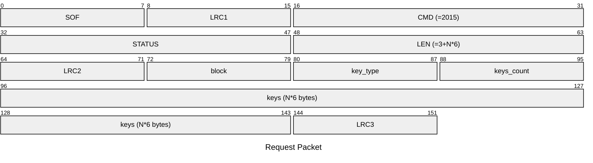
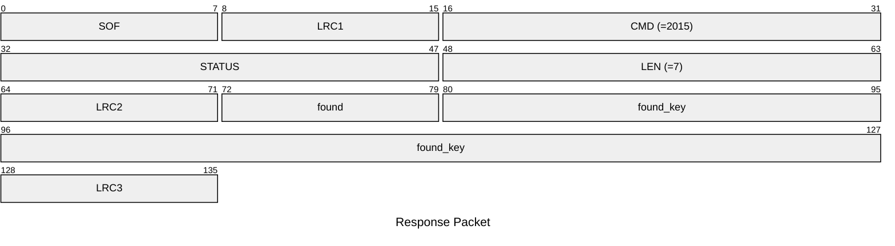

# 2015: MF1_CHECK_KEYS_ON_BLOCK

Check keys on block of Mifare Classic tag in batch.

## Request Packet

* DATA in Request Packet
    * block: `1 byte`, the block number to check.
    * key_type: `1 byte`, the key type to check. `0x60`=key A, `0x61`=key B.
    * keys_count: `1 byte`, the number of keys to check (N).
    * keys: `N*6 bytes`, the keys to check.

## Response Packet

* DATA in Response Packet
    * found: `1 byte`, whether a key is found. `0x00`=not found, `0x01`=found.
    * found_key: `6 bytes`, the found key. Valid only if `found`=`0x01`.