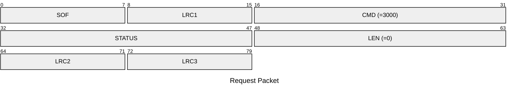
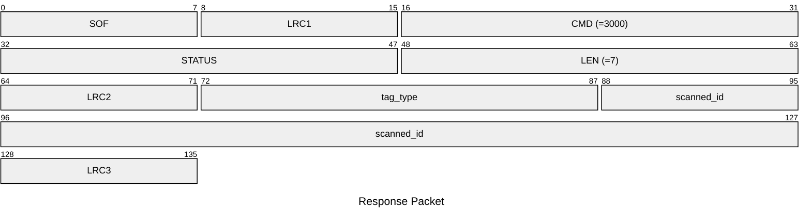

# 3000: EM410X_SCAN

Scan ID of EM410x tags.

* CLI: cf `lf em 410x read`

## Request Packet

* DATA in Request Packet: None

## Response Packet

* DATA in Response Packet
    * tag_type: 2 bytes. The type of the scanned tag. Please refer to `TagSpecificType` enum.
    * scanned_id: 5 bytes. The EM410x tag ID be scanned.