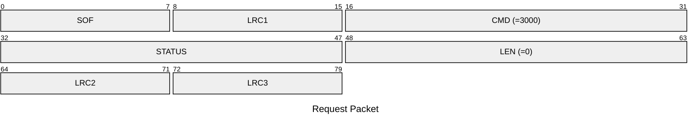
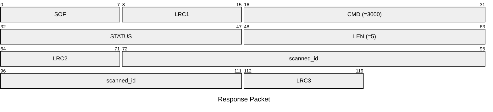

# 3000: EM410X_SCAN

* CLI: cf `lf em 410x read`

## Request Packet

* DATA in Request Packet: None

## Response Packet

* DATA in Response Packet
    * scanned_id: 5 bytes. The EM410x tag ID be scanned.