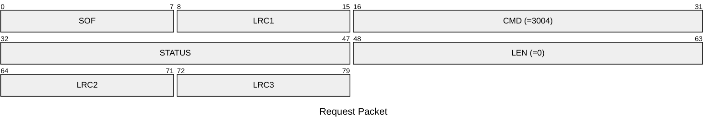
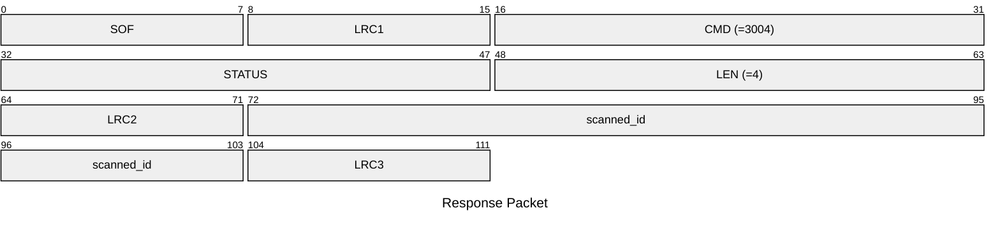

# 3004: VIKING_SCAN

Scan ID of Viking tags.

## Request Packet

* DATA in Request Packet: None

## Response Packet

* DATA in Response Packet
    * scanned_id: 4 bytes. The Viking tag ID be scanned.