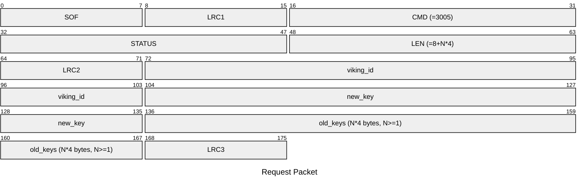
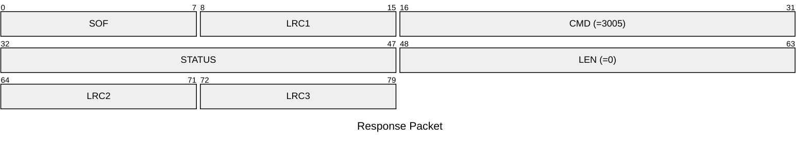

# 3005: VIKING_WRITE_TO_T55XX

Write Viking ID to T55xx tag.

## Request Packet

* DATA in Request Packet
    * viking_id: `4 bytes`, The Viking tag ID to write to the T55xx tag.
    * new_key: `4 bytes`, The new key to be written to the T55xx tag. The key will also be add to old keys list.
    * old_keys: `N*4 bytes, N>=1`, The old keys to be used for authentication.

## Response Packet

* DATA in Response Packet: None