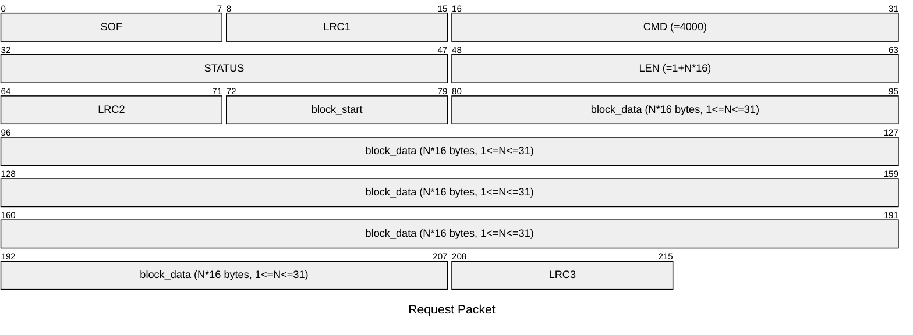
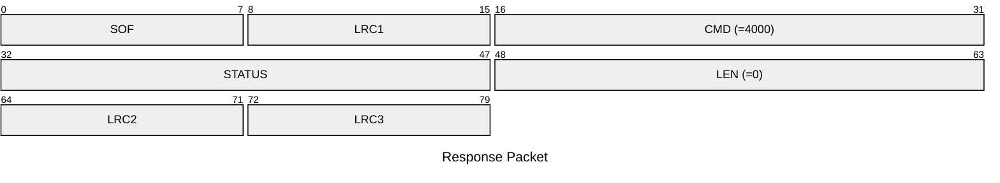

# 4000: MF1_WRITE_EMU_BLOCK_DATA

* CLI: cf `hf mf eload`

## Request Packet

* DATA in Request Packet
    * block_start: 1 byte. The start block number to write data.
    * block_data: N*16 bytes. The data to write into the emulator.

## Response Packet

* DATA in Response Packet: None