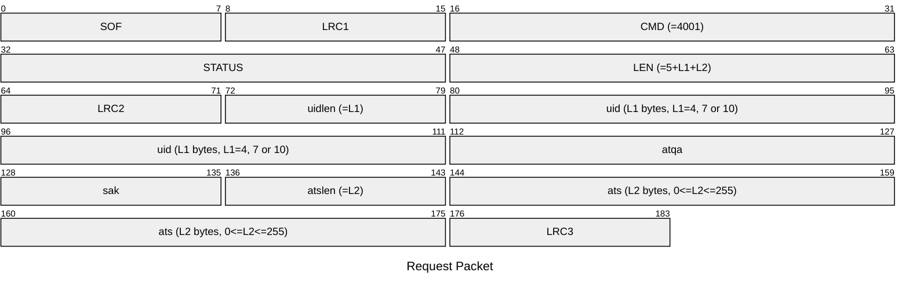
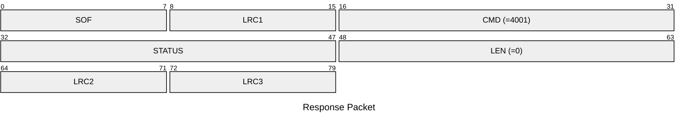

# 4001: HF14A_SET_ANTI_COLL_DATA

Set anti-collision data to emulator.

* CLI: cf `hf mf econfig`/`hf mfu econfig`

## Request Packet

* DATA in Request Packet
    * uidlen: `1 byte`, length of UID (L1, L1 is 4, 7 or 10).
    * uid: `L1 bytes, L1=4, 7 or 10`, UID of the 14443-3 (Type A) tag.
    * atqa: `2 bytes`, ATQA of the 14443-3 (Type A) tag.
    * sak: `1 byte`, SAK of the 14443-3 (Type A) tag.
    * atslen: `1 byte`, length of ATS (L2, 0<=L2<=255).
    * ats: `L2 bytes, 0<=L2<=255`, ATS of the 14443-3 (Type A) tag.

* Command: N bytes: `uidlen|uid[uidlen]|atqa[2]|sak|atslen|ats[atslen]`. UID, ATQA, SAK and ATS as bytes.

## Response Packet

* DATA in Response Packet: None