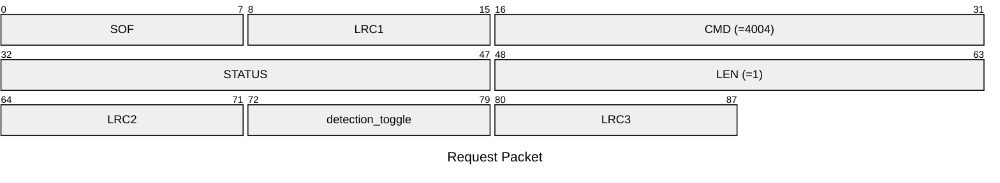
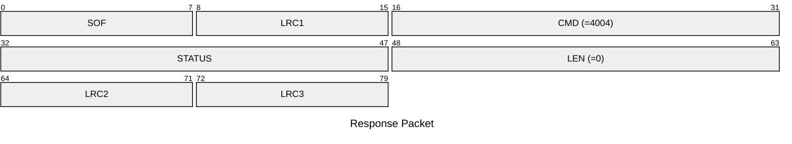

# 4004: MF1_SET_DETECTION_ENABLE

Enable/disable AUTH error logger of Mifare Classic emulator for MFKey32 attack.

* CLI: cf `hf mf econfig`

## Request Packet

* DATA in Request Packet
    * detection_toggle: `1 byte`. Enable or disable the MIFARE detection logger.

## Response Packet

* DATA in Response Packet: None