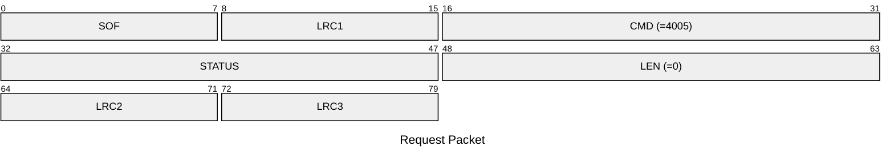
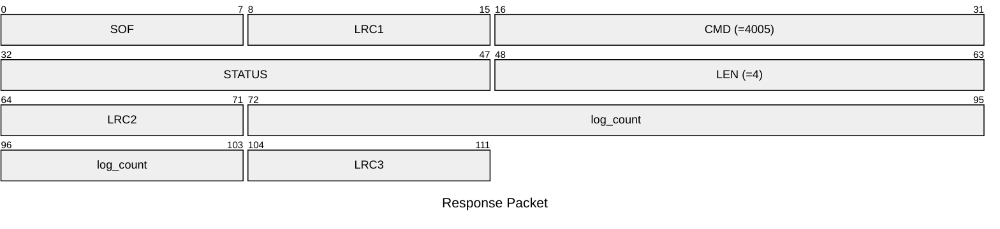

# 4005: MF1_GET_DETECTION_COUNT

* CLI: cf `hf mf elog`

## Request Packet

* DATA in Request Packet: None

## Response Packet

* DATA in Response Packet
    * log_count: `4 bytes`. The count of AUTH error log of Mifare Classic emulator for MFKey32 attack.