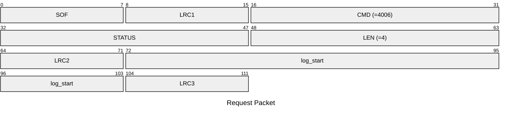
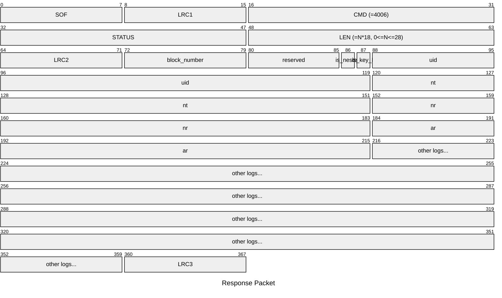

# 4006: MF1_GET_DETECTION_LOG

* CLI: cf `hf mf elog`

## Request Packet

* DATA in Request Packet
    * log_start: `4 bytes`, U32 in network byte order. The start index of detection log to read.

## Response Packet

* DATA in Response Packet
    * block_number: `1 byte`. The block number of this AUTH error log.
    * is_nested: `1 bit`. `0b1` if this AUTH error log is nested AUTH.
    * is_key_b: `1 bit`. `0b1` if this AUTH error log is using Key B to AUTH.
    * uid: `4 bytes`, U32 in network byte order. The UID of the MIFARE Classic tag.
    * nt: `4 bytes`, U32 in network byte order. The tag nonce (NT) of this AUTH error log.
    * nr: `4 bytes`, U32 in network byte order. The encrypted reader nonce (NR) of this AUTH error log.
    * ar: `4 bytes`, U32 in network byte order. The encrypted reader answer (AR) of this AUTH error log.