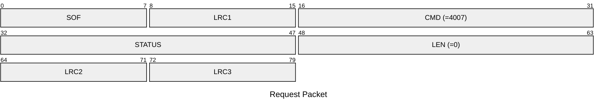
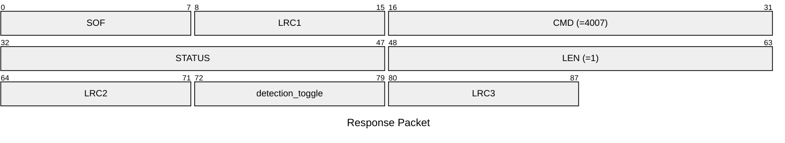

# 4007: MF1_GET_DETECTION_ENABLE

* CLI: cf `hw slot list`

## Request Packet

* DATA in Request Packet: None

## Response Packet

* DATA in Response Packet
    * detection_toggle: `1 byte`. The MIFARE detection logger is enabled or disabled.